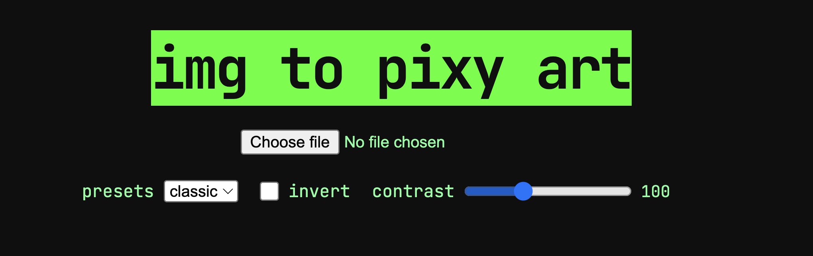

</head>
<body>
<h1>PROJECT TITLE: Picsii"</h1>

<h3>AUTHOR : ATHARV ANAND</h3>
 
<h2>How To Use The Website</h2>

  It's very easy just open the website, choose an image file, then pick a preset (classic, sketch, solid, dot), toggle invert if you want, and adjust the contrast slider to fine-tune the output and boo u will get ur picsii img.

  
  

<h3>Why I made this website ?</h3>

  I made this website because I wanted to build something visual and fun that turns any image into text-based art.

<h2>Some cool features</h2>
<ul>
  <li> 4 different presets i.e. classic, sketch, solid and  dot </li>
  <li> invert toggle to flip brightness mapping over the img </li>
  <li> contrast slider for fineness over the output img </li>
  <li> on a click copy button to grab the picsii art to clipboard </li>
</ul>

<h3> AI use </h3>

none

<h2>TECH STACK</h2>
 
 

  
</li>
  

</li>
</ul>
</body>
</html>

